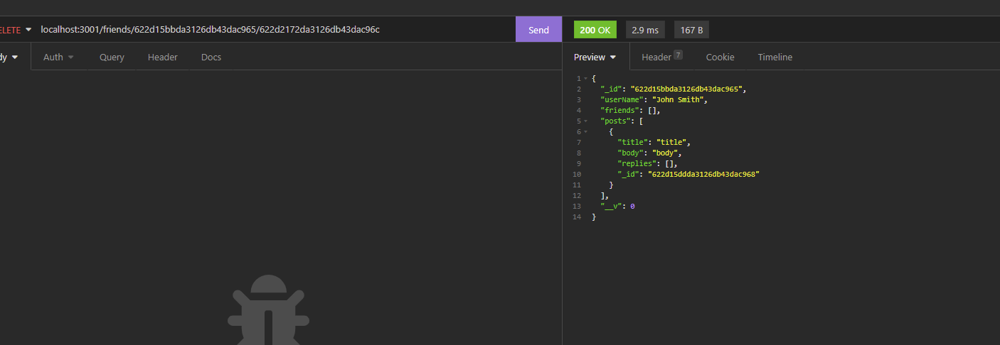
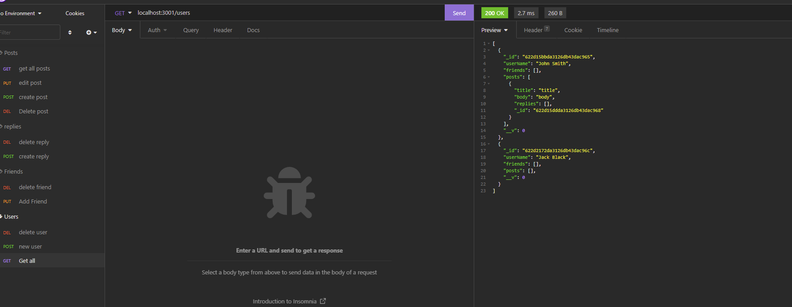

# Social Platform API

## Landing Page

This is a social platform api that allows the user to interact with mongo db. To install the api simply type "npm i" then start it as you would any other server.js file. Above every api call there is a comment that tells you the endpoint and the required information for the call.

## Screenshot
Note the video got cut off due to lack of time. The missing information was the delete friend request which I included the 2 screenshots of in this readme.

### The mp4 is in the repo

## Questions

You can reach the creator of this project at:
[Github](http://github.com/Travis-Anderson023)
[email](mailto:tsanderson.023@gmail.com)